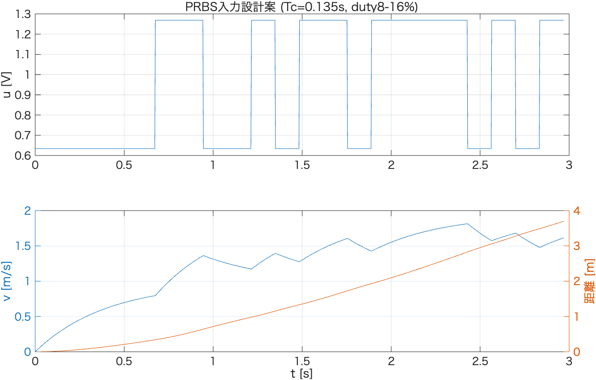

# PRBS入力設計（並進方向）

`step_identification_report.md`で得たduty 10%/15%/20%の同定結果を用いて，PRBS本同定実験の
入力パラメータ（クロック周期Tc・duty範囲）を設計し，走行距離制約を事前シミュレーションで検証した記録。
`system_identification_flow.md` §1 [3]「PRBS設計」に対応。

- 解析コード: [`prbs_design.m`](./prbs_design.m)（`step_analyze.m`の出力`results/step_identification_summary.csv`,
  `results/step_identification_final.csv`を読み込んで実行）
- 制約: 1試行最大3.0秒，使用可能な直線空間4〜5m（`system_identification_flow.md`より）

---

## 1. 入力：各duty水準の同定結果

| duty | $K_p$ [mm/s/V] | $T_{p1}$ [s] | 備考 |
|---|---|---|---|
| 10% | 1401.6 | 0.4212 | **最遅点**（最大$T_{p1}$）→ カバレッジ確認に使用 |
| 15% | 1483.4 | 0.3930 | **最速点**（最小$T_{p1}$）→ クロック周期$T_c$の決定に使用 |
| 20% | 1536.6 | 0.3988 | **最大ゲイン点** → 距離シミュレーションの保守的評価に使用 |

不感帯電圧: $u_0 = 0.1336$ V（`step_identification_report.md` §2 より）

`system_identification_flow.md`は「最速点＝最大K/最小T」を想定しているが，実測では最大$K_p$点（20%）と
最小$T_{p1}$点（15%）が一致しなかった。3水準の$T_{p1}$のばらつきは0.393〜0.421s（約7%）と小さく，
主要な非線形性はゲインスケジューリングというより不感帯（オフセット誤差）に起因すると考えられる。
そのため設計では，$T_c$は文字通り最小$T_{p1}$点（15%）から，距離の安全側評価は最大$K_p$点（20%）から
それぞれ個別に決定した。

---

## 2. クロック周期 $T_c$ の決定

目安: $T_c \lesssim \tau_{fast}/2.8$

$$T_c \lesssim 0.3930/2.8 = 0.1404\ \text{s}$$

**採用値: $T_c = 0.135$ s**（上限を満たす）

---

## 3. 段数 $n$ とカバレッジ確認

ハードウェアのLFSR実装（`system_identification_flow.md`記載: $n=8$, tap `0xB8`）を前提とし，
最長パルス幅 $nT_c$ が最遅点の時定数に対して十分か確認：

$$nT_c = 8 \times 0.135 = 1.080\ \text{s} \quad\geq\quad 2.5\,\tau_{slow} = 2.5 \times 0.4212 = 1.053\ \text{s}\ \checkmark$$

→ 最遅点（duty10%）の定常応答に十分近づけるパルス幅を確保できている（マージンは小さめ）。

---

## 4. duty範囲の決定（不感帯マージン）

実測の$u_{step}=duty\times V_{batt}$から公称バッテリ電圧を逆算: $V_{batt,nom} = 7.930$ V

| | duty | 実効電圧 | 不感帯比 |
|---|---|---|---|
| $duty_{min}$ | 8% | 0.634 V | $u_{min}/u_0 = 4.7\times$ |
| $duty_{max}$ | 16% | 1.269 V | — |

不感帯電圧からのマージン目安（$3〜5\times u_0$）を満たす。`data_analysis`の既存設計（duty 8-16%）と同一値を踏襲。

---

## 5. 事前シミュレーション：距離制約の検証

最大ゲイン点（duty20%: $K_p=1536.6$, $T_{p1}=0.3988$）のモデルを用い，上記$T_c$・duty範囲でのPRBS入力を
3.0秒間印加した場合の走行距離を保守的に評価：

| 量 | 値 |
|---|---|
| 最大速度 | 1.81 m/s |
| 3.0秒後の総走行距離 | 3.70 m |

使用可能空間（4〜5m）に対し十分な余裕（約0.3〜1.3m）で収まることを確認した。

数値データ: [`results/prbs_design_params.csv`](./results/prbs_design_params.csv)

---

## 6. 採用パラメータまとめ

| パラメータ | 値 |
|---|---|
| クロック周期 $T_c$ | 0.135 s |
| LFSR段数 $n$（実装済み） | 8 |
| duty範囲 | 8% 〜 16% |
| 1試行の走行時間 | 3.0 s |

## 7. 次のステップ

- `system_identification_flow.md` §1 [4]「PRBS応答収集」へ進む：上記パラメータで多試行データを収集
  （バッテリ電圧補償あり）。1試行(3.0s, $T_c=0.135s$)では約22クロック分しか再生されず，
  LFSRのフル周期（$2^8-1=255$）の一部に留まるため，複数試行での統合（`merge`）が前提となる
- [5] procest / ETFE推定・holdout検証
