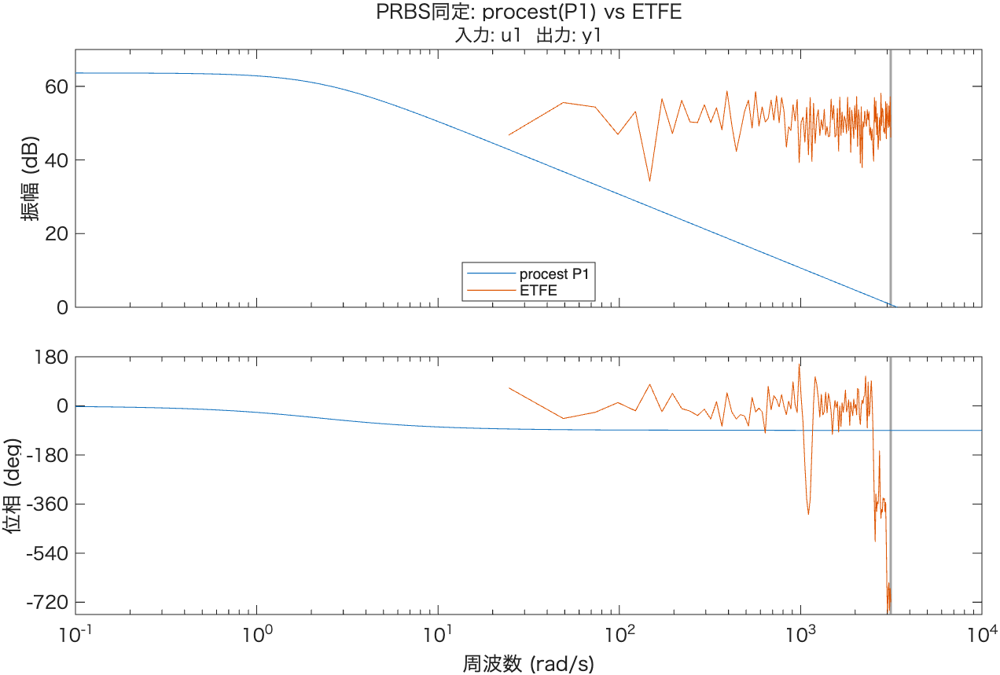
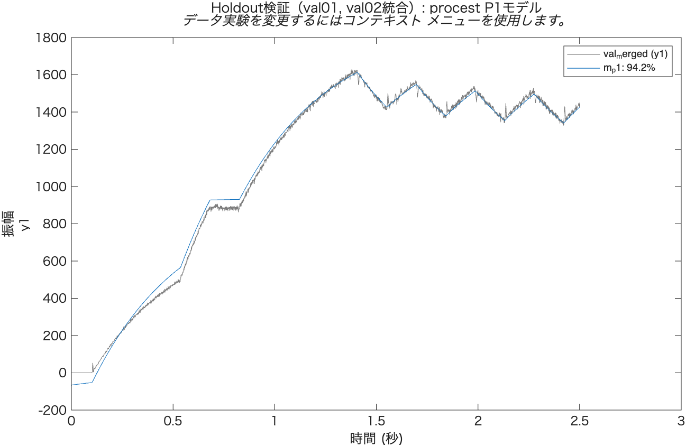
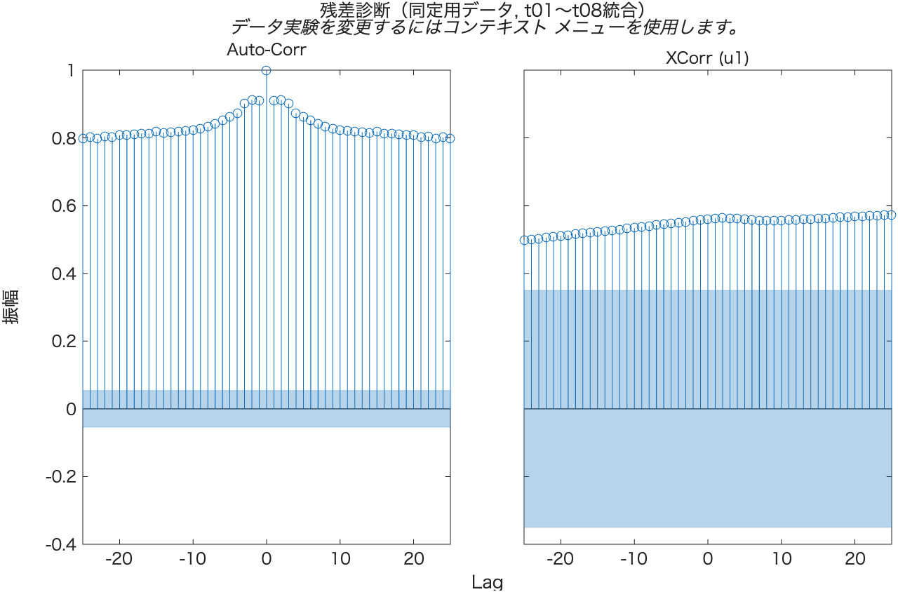

# PRBS本同定レポート（並進方向）

`tools/log/prbs_trans_x/prbs_trans_{t01..t08,val01,val02}.csv`（`prbs_design.m`で設計した
$T_c=0.145s$, duty 8〜16%, 1試行2.4sのPRBS入力，同定用8試行＋検証用2試行）を用いた本同定の記録。
`system_identification_flow.md` §1 [4][5]に対応。

- 解析コード: [`prbs_analyze.m`](./prbs_analyze.m)
- 使用ツール: MATLAB R2026a, System Identification Toolbox (`procest`, `etfe`, `merge`, `compare`, `resid`)
- 生データ: `tools/log/prbs_trans_x/`（gitignore対象のため本リポジトリには含まれない）

---

## 1. 壁衝突データのトリミング

実機走行のうち，走行終盤（トライアル後半）に壁へ衝突し，IMU値（特に`accel_x`）が異常値になっている
トライアルが確認された。通常のPRBS走行中の`|accel_x|`は最大でも3000〜4700mm/s²程度だが，
衝突時は瞬間的に30000〜41000mm/s²まで跳ね上がり，明確に分離できる。

**検出方法**（`load_prbs_trial`関数）: 各トライアルの駆動区間（duty≠0の区間）内で，
`|accel_x| > 8000 mm/s²`を初めて超えた時刻を壁衝突とみなし，その10サンプル（10ms）手前で
データを打ち切る。閾値8000は通常走行時の最大値（~4700）と衝突時の最小値（~32000）の間に
大きなマージンを持って設定した。

| トライアル | 判定 | 詳細 |
|---|---|---|
| t01 | **衝突あり** | t=2.288sで検知 → t=2.278sで打ち切り（2280/2502サンプル使用） |
| t02 | **衝突あり** | t=2.257sで検知 → t=2.247sで打ち切り（2232/2502サンプル使用） |
| t03 | **衝突あり** | t=2.211sで検知 → t=2.200sで打ち切り（2186/2502サンプル使用） |
| t04 | 衝突なし | 全2401サンプル使用 |
| t05 | **衝突あり** | t=2.227sで検知 → t=2.217sで打ち切り（2219/2502サンプル使用） |
| t06 | 衝突なし | 全2401サンプル使用 |
| t07 | 衝突なし | 全2401サンプル使用 |
| t08 | 衝突なし | 全2401サンプル使用 |
| val01 | 衝突なし | 全2401サンプル使用 |
| val02 | 衝突なし | 全2401サンプル使用 |

衝突トライアル（t01, t02, t03, t05）では，衝突直前に左右エンコーダ速度の片側が急減/逆転し，
衝突直後もその不整合（片輪スリップ・機体スピン）が試行終了まで残る挙動を確認した
（`accel_x`が収束した後もエンコーダ値自体は正常な走行と異なるため，打ち切り以降のデータは
一切使用しない方針とした）。

---

## 2. procest(P1)によるパラメトリック推定

t01〜t08（トリミング後）を`merge`で統合し，1次遅れモデル(P1)を同定：

$$G_V(s) = \frac{K_p}{T_{p1}s+1}$$

| パラメータ | 値 |
|---|---|
| $K_p$ | 1518.9 ± 0.7 mm/s/V |
| $T_{p1}$ | 0.4451 ± 0.0007 s |
| 各試行への適合率 | 93.7 / 93.4 / 90.8 / 88.3 / 93.0 / 81.6 / 93.3 / 74.2 %（平均88.5%） |

不確かさ（標準誤差）はstep応答同定（3水準平均, Kp標準誤差±3〜4）と比べて1桁小さく，
8試行・広帯域励振による同定精度の向上が確認できる。

t06, t08は衝突なし判定だが適合率がやや低め（81.6%, 74.2%）。個別ログを確認したが
明確な異常区間は見当たらず，通常のPRBS応答のばらつき（片輪スリップ等の軽微な非線形性）と考えられる。

---

## 3. P2モデルとの比較（構造検証）

2次遅れモデル(P2)でも同定し，1次系で十分かを確認：

| モデル | $K_p$ | $T_{p1}$ | $T_{p2}$ | 平均適合率 |
|---|---|---|---|---|
| P1 | 1518.9 ± 0.7 | 0.4451 ± 0.0007 | — | 88.53% |
| P2 | 1519.3 ± 3.6 | 0.4463 ± 0.0009 | (1.26±3.4)e-6 s | 88.52% |

P2の第2極$T_{p2}$は実質ゼロに収束し（不確かさが値自体より大きい），適合率もP1と同水準。
**2つ目の極は存在せず，1次系(P1)が適切なモデル構造である**ことが裏付けられた
（`data_analysis`の既存PRBS同定と同じ結論）。

---

## 4. ETFE（ノンパラメトリック）との比較

中〜高周波数域（約30〜1000 rad/s）でP1モデルとETFEの振幅特性はおおむね整合している。
ETFEのデフォルト周波数グリッドはプラントの折れ点周波数（$1/T_{p1}\approx2.2$ rad/s）付近の
低周波域までは伸びておらず，その帯域での直接比較はできていない（今後，周波数範囲を明示的に
指定したETFE再計算で低周波域も確認する余地がある）。

---

## 5. Holdout検証

同定に使用していないval01, val02を`merge`した検証データに対するP1モデルの当てはまり：

**フィット率: 94.2%**。同定用データの平均適合率（88.5%）より高く，過学習していないことを確認。
holdoutは衝突なしトライアルのみのため，衝突トリミングの影響を受けていないクリーンな検証となっている。

---

## 6. 残差診断

自己相関・入力との相互相関ともに有意水準（信頼区間）を明確に超えている。§3のP2比較で
2次系にしても改善しないことから，**残差の構造は極の見落としではなく**，エンコーダ量子化ノイズの
自己相関や，duty水準依存の非線形性（step応答同定で確認した不感帯・ゲイン変化）など，
線形P1モデルの枠外の要因に起因すると考えられる。運用上はholdoutフィット94.2%が実用上十分な
水準であるため，現段階ではP1モデルを採用し，残差構造の追究は今後の課題とする。

---

## 7. ステップ応答同定との比較

| | $K_p$ [mm/s/V] | $T_{p1}$ [s] | 備考 |
|---|---|---|---|
| Step応答（3水準平均, 暫定値） | 1523.7 | 0.4303 | `step_identification_report.md` |
| **PRBS本同定（採用）** | **1518.9 ± 0.7** | **0.4451 ± 0.0007** | holdout適合94.2% |

$K_p$は0.3%差，$T_{p1}$は3.4%差で良好に一致しており，相互に整合的な結果が得られた。
PRBS本同定の方が不確かさが大幅に小さいため，制御設計にはこちらを採用する。

---

## 8. 最終モデルと今後の反映

$$G_V(s) = \frac{v(s)}{u(s)} = \frac{1518.9}{1+0.4451s} \quad \left[\frac{\text{mm/s}}{\text{V}}\right]$$

`mouse_config.hpp`の`config::pid_velocity_x::K_p`, `T_p1`は現在step応答由来の暫定値
（1523.7, 0.4303）となっている。本結果への更新が次のアクション。

数値データ: [`results/prbs_identification_summary.csv`](./results/prbs_identification_summary.csv)
