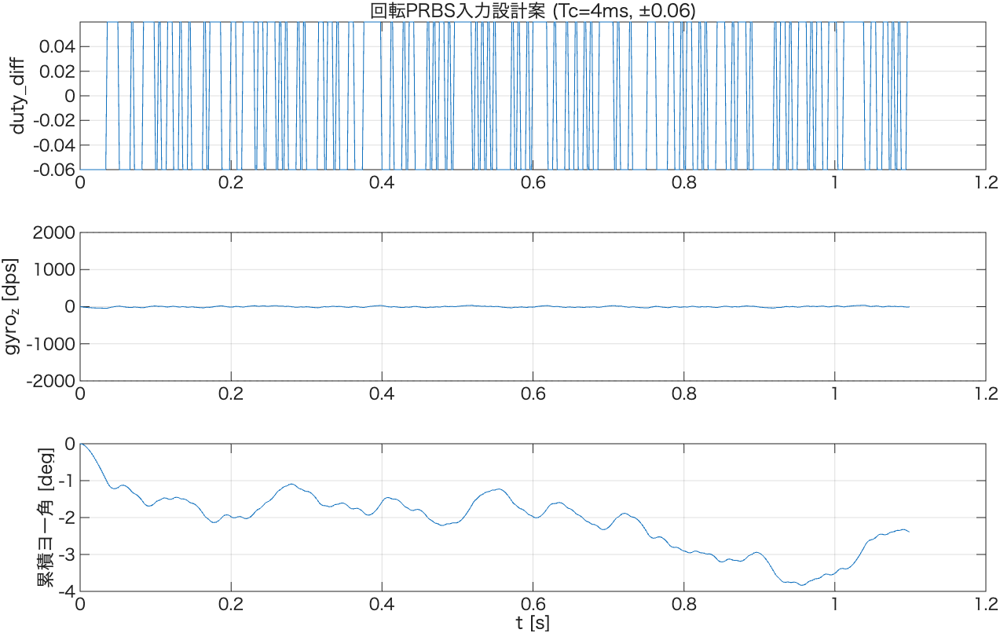

# PRBS入力設計（回転方向, 並進700mm/s固定）

`rot_step_v700_report.md`で確認した「クリーン」線形領域（duty_diff ±0.02〜0.06）の結果から，
回転PRBS本同定実験のクロック周期$T_c$・duty_diff振幅を設計し，事前シミュレーションで検証した記録。
`system_identification_flow.md` §2 [3]「回転PRBS同定」に対応。

- 解析コード: [`prbs_rot_design.m`](./prbs_rot_design.m)
- 前提: 並進速度700mm/sを閉ループで固定した状態でduty_diffをPRBS励振する
  （`rot_step_v700_tester`と同じ構成，励振部のみPRBS化）

---

## 1. 入力：rot_step_v700のクリーン領域からの時定数換算

$t_{90}$（定常値の90%到達時間）を1次系近似で時定数に換算（$\tau = t_{90}/\ln10$）：

| duty_diff | $t_{90}$ | $\tau$ |
|---|---|---|
| +0.04 | 28 ms | 12.16 ms（**最速**） |
| +0.06 | 30 ms | 13.03 ms |
| -0.04 | 36 ms | 15.63 ms |
| -0.06 | 39 ms | 16.94 ms（**最遅**） |

±0.02は静止摩擦の影響で正負ゲイン差が16.7%と大きく，代表時定数の見積もりには使用していない
（`rot_step_v700_report.md` §4）。±0.10以上は片輪が不感帯・負転に入る非線形領域のため対象外。

---

## 2. クロック周期 $T_c$ の決定

- 上限（速い極を粗く均さない）: $T_c \lesssim \tau_{fast}/2.8 = 12.16/2.8 = 4.34$ ms
- 下限（LFSR段数$n=8$実装済みでの最長パルス幅が最遅点をカバー）: $T_c \gtrsim 2.5\tau_{slow}/n = 2.5\times16.94/8 = 5.29$ ms

**この2条件は両立しない**（下限5.29ms > 上限4.34ms）。回転方向の時定数（12〜17ms）が
並進（420〜450ms）よりずっと短く，かつ$n=8$のLFSR段数が固定であるため，並進の設計時のような
ギリギリの両立が今回は成立しなかった。

**採用: $T_c = 4$ ms**（高域分解能を優先）。理由：
- $T_c$は1ms制御周期の整数tickでしか実現できない（`PRBS::configure`の`ticks_per_clock`）ため，
  候補は4msか5msの2択
- $T_c=5$msだと上限(4.34ms)を15%超過する一方，$T_c=4$msなら上限を満たす
- カバレッジ不足（最長パルス幅32.0ms／目安42.3ms＝76%）は複数試行の`merge`で補う方針とする

---

## 3. duty_diff振幅

**採用: ±0.06**（`rot_step_v700`で確認したクリーン領域の上限）。
この振幅ではゲイン707〜804dps/duty，正負差1.9%と良好な線形性・対称性を確認済み
（±0.10以上は片輪が不感帯・負転に入るため除外）。

---

## 4. 試行時間

$n=8$のLFSR全周期は$2^8-1=255$クロック。$T_c=4$msでは全周期がわずか**1.02秒**に収まる
（並進は2.4秒で全周期255クロックの1/3程度しか再生できなかったのと対照的に，回転は
1試行でほぼ全周期を励振できる）。

**採用: 1試行1.1秒**（全周期に若干の余裕を持たせた値）。

---

## 5. 事前シミュレーション：安全性の確認

クリーン領域代表モデル（$K_{p,rot}=764.0$ dps/duty, $T_{p1,rot}=14.4$ ms）を用いて，
設計したPRBS入力（$T_c=4$ms, ±0.06, 1.1秒）に対する応答をシミュレーション：

| 量 | 値 |
|---|---|
| 最大\|gyro_z\| | 42.1 dps（IMU飽和2000dpsの2.1%） |
| 試行終了時の累積ヨー角 | -2.4° |
| 試行中の最大\|累積ヨー角\| | 3.8° |

IMU飽和に対して極めて大きな余裕がある。また，PRBSは正負のバランスが取れた信号のため
**累積ヨー角も4°未満**に収まり，1試行の間に機体が大きく向きを変えてしまう心配もない
（並進のような走行距離の制約がそもそも小さい）。

---

## 6. 採用パラメータまとめ

| パラメータ | 値 |
|---|---|
| クロック周期 $T_c$ | 4 ms |
| LFSR段数 $n$（実装済み） | 8 |
| duty_diff振幅 | ±0.06 |
| 1試行の時間 | 1.1 s |
| 並進速度（固定） | 700 mm/s |

## 7. 次のステップ

- `system_identification_flow.md` §2 [3]→[4]：上記パラメータでPRBS応答収集を実装する
  （`rot_step_v700_tester`と同様の構成で，励振フェーズをPRBS化。`MotorDriver::setDutyDiff()`に
  `PRBS`インスタンスの出力を渡す仕組みが必要）
- 1試行でLFSR全周期をほぼ再生できるため，並進(8試行)ほど多くの試行数は不要と見込まれる。
  ノイズ平均化・holdout検証を考慮し，同定用3〜4試行＋検証用2試行程度を目安とする
- procest(P1)によるパラメトリック推定・holdout検証（並進と同じ流れ）
