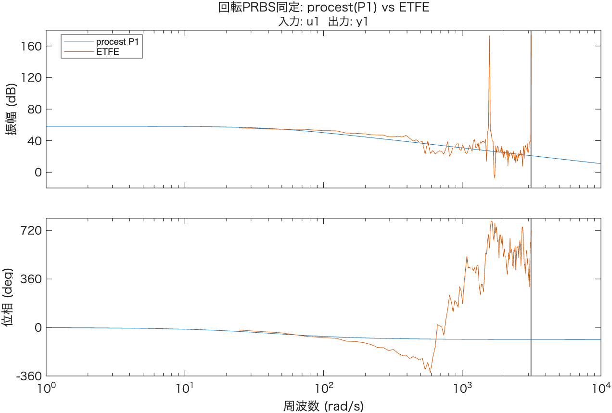
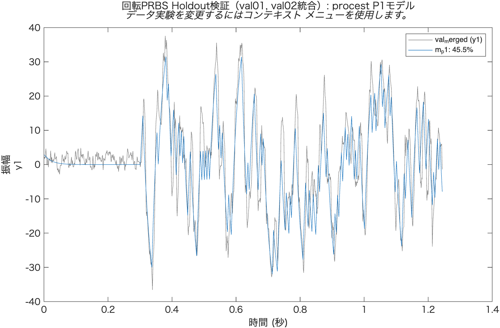

# PRBS本同定レポート（回転方向, 並進700mm/s固定）

`tools/log/prbs_rot_v700_x/prbs_rot_{t01-t04,val01,val02}.csv`
（`prbs_rot_design_report.md`の設計: Tc=4ms, duty_diff振幅±0.06, 1試行1.1s）の解析結果。
`system_identification_flow.md` §2 [4][5]に対応。

- 解析コード: [`prbs_rot_analyze.m`](./prbs_rot_analyze.m)

---

## 1. 既知の不具合と回避策

ログの`duty_diff`列は，`MotorDriver::getDutyDiff()`が静的`setDutyDiff()`の値のみを返す実装に
なっており，**PRBSでduty差を駆動した場合は実際に印加された値を反映しない**（常に0を記録する）。
`Right Duty - Left Duty`を計算すると±0.06の正しいPRBSパターンが確認でき，**実際のモータ制御
自体は正常**（この不具合はログ記録のみに限定）であることを確認した。本解析では実効duty差を
`RightDuty - LeftDuty`から直接算出することで回避している。ファームウェア側は別途修正が必要
（後述）。

衝突判定（並進PRBSと同じ手法，励振区間内で`|accel_x|>8000`を検知）では全6試行とも
検知なし（励振区間内max|accel_x|は699〜1080）。

## 2. 前処理：並進加速区間のノイズ除外

並進速度0→700mm/sの立ち上げ加速区間（duty_diff=0のはずの区間）で，機体振動と思われる
大きなgyro_zの乱れ（最大-90dps程度）を確認した。この区間を同定データに含めるとフィット率が
大きく悪化する（除外前平均30.0%→除外後平均44.6%）ため，**励振開始直前300ms**（並進速度が
安定した後の静止基準区間）のみをゼロ初期条件用のベースラインとして使用している。

## 3. procest(P1)によるパラメトリック推定

t01〜t04を`merge`で統合し，1次遅れモデル(P1)を同定：

| パラメータ | 値 |
|---|---|
| $K_{p,rot}$ | 813.3 ± 11.0 dps/duty |
| $T_{p1,rot}$ | 23.1 ± 0.4 ms |
| 各試行への適合率 | 42.0 / 44.4 / 42.0 / 50.1 %（平均44.6%） |

`rot_step_v700`のクリーン領域平均（±0.04, 0.06: 764.0 dps/duty）と比較して**6.5%高い**が，
同程度のオーダーで良好に一致している。$T_{p1,rot}$は，step応答の$t_{90}$から粗く見積もった
値（12〜17ms）よりやや大きい23ms程度と判明した。

適合率44.6%は並進PRBS（88.5%）と比べて低いが，Bode線図（ETFE比較）では低〜中周波数域
（〜300rad/s程度まで）でP1モデルとETFEが良く一致しており（下図），高周波数域でのノイズ・
共振的な成分がタイムドメインの適合率指標を押し下げていると考えられる。holdout検証の時系列
比較でも，モデルは実測の変動パターン・タイミングを概ね捉えている。

## 4. Holdout検証

フィット率45.5%。時系列で見ると，PRBSの各パルスに対する立ち上がり・ピークのタイミングは
モデルと実測でよく一致しており，振幅面でやや実測の方が大きく振れる（高周波成分・ノイズの
寄与）という傾向が見て取れる。

## 5. まとめ

$$G_{rot}(s) = \frac{\omega(s)}{u_{diff}(s)} = \frac{813.3}{1+0.0231s} \quad \left[\frac{\text{dps}}{\text{duty}}\right]$$

- $K_{p,rot}$はstep応答（クリーン領域平均764.0）と6.5%差で整合
- $T_{p1,rot}\approx23$msは並進（445ms）の1/19程度と極めて高速
- フィット率は並進PRBSより低いが，低〜中周波数での挙動は良く再現できている
- **要修正**: `MotorDriver::getDutyDiff()`がPRBS駆動時の実値を返さないログ不具合を修正すること
  （次回以降の試行で正しい`duty_diff`列が得られるようにする）
