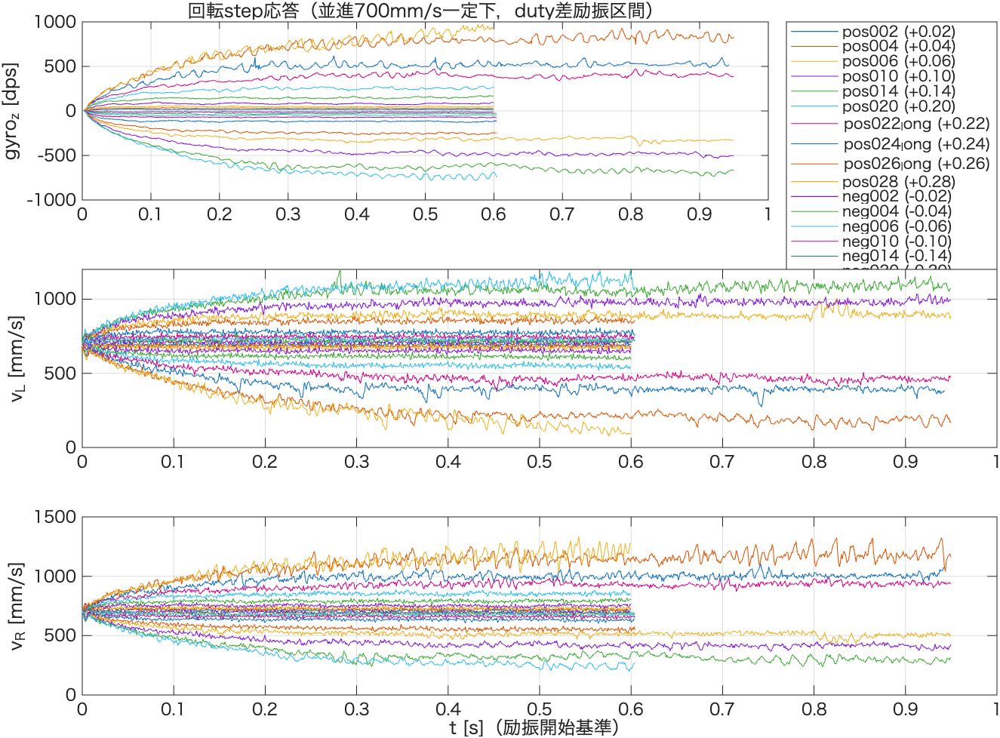
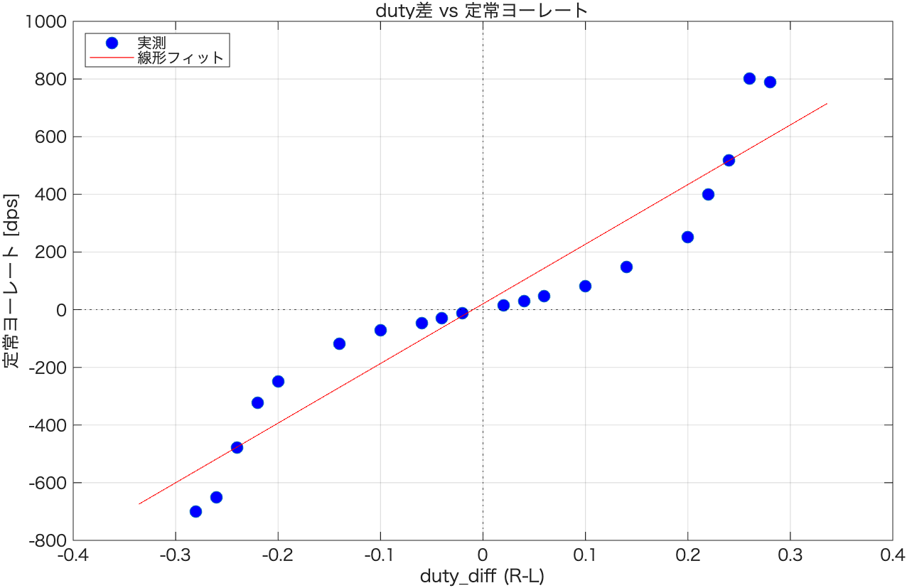

# 回転方向 事前同定レポート（並進700mm/s固定 + 左右duty差ステップ）

`tools/log/rot_step_v700_x/rot_step_v700_duty_{pos,neg}{002,004,006,010,014,020,028}.csv`
（並進速度700mm/sを閉ループで固定し，左右duty差(R-L)を±0.02/0.04/0.06/0.10/0.14/0.20/0.28で
ステップ印加，励振600ms）に加え，`rot_high_amplitude_test_plan.md` 試験1で追加取得した
±0.22/0.24/0.26（励振2000ms，`*_long.csv`）の解析結果。`system_identification_flow.md` §2 [2]
「回転step実験」に対応。

**追記（実運用目標との照合）**: 実運用では700mm/s時に角加速度目安2500deg/s²，最高角速度目安
430deg/sで運用予定とのこと。±0.14までの特性（最大171dps）では目標に遠く届かないため，
±0.20/±0.28を追加取得し，さらに430dpsを直接挟み込むため±0.22/0.24/0.26を励振2000msで
追加取得した（§6参照）。

**データ品質に関する注記**: `MotorDriver::applied_duty_diff_`（ログ列`duty_diff`の実体）が
`setBreak()`でリセットされないファームウェア上の不具合があり，前試行の値が次試行冒頭の静止区間に
短く漏れ残ることが判明した（±0.22/0.24/0.26の6ファイルで確認）。単純な「最初のnonzero検出」では
この偽励振を誤検出するため，本解析では`find_longest_nonzero_run()`により**最長の連続nonzero区間**を
真の励振窓として採用している（詳細はスクリプト内コメント参照）。ファームウェア側の恒久修正
（`setBreak()`で`applied_duty_diff_`をリセット）は別途対応予定。

- 解析コード: [`rot_step_v700_analyze.m`](./rot_step_v700_analyze.m)

---

## 1. 結果一覧

| duty_diff (R-L) | 定常ヨーレート | \|gyro\|max | 並進速度(平均) | 90%整定時間 |
|---|---|---|---|---|
| +0.02 | +14.1 dps | 22.4 dps | 702 mm/s | 20 ms |
| +0.04 | +29.3 dps | 38.0 dps | 702 mm/s | 28 ms |
| +0.06 | +48.2 dps | 60.0 dps | 702 mm/s | 30 ms |
| +0.10 | +81.5 dps | 101.2 dps | 701 mm/s | 37 ms |
| +0.14 | +148.9 dps | 171.2 dps | 702 mm/s | **91 ms** |
| -0.02 | -12.0 dps | 16.5 dps | 703 mm/s | 27 ms |
| -0.04 | -29.2 dps | 50.8 dps | 703 mm/s | 36 ms |
| -0.06 | -47.3 dps | 59.1 dps | 703 mm/s | 39 ms |
| -0.10 | -71.2 dps | 80.7 dps | 703 mm/s | 44 ms |
| -0.14 | -117.4 dps | 130.7 dps | 705 mm/s | 62 ms |
| +0.20 | +252.1 dps | 280.1 dps | 703 mm/s | 160 ms |
| +0.22（長時間励振2000ms） | +399.7 dps | 472.4 dps | 699 mm/s | 254 ms |
| +0.24（同上） | +518.3 dps | 621.2 dps | 697 mm/s | 200 ms |
| +0.26（同上） | +801.0 dps | 927.2 dps | 681 mm/s | 257 ms |
| +0.28 | +788.2 dps | 974.1 dps | 675 mm/s | 237 ms |
| -0.20 | -248.2 dps | 268.8 dps | 705 mm/s | 143 ms |
| -0.22（長時間励振2000ms） | -322.4 dps | 396.3 dps | 702 mm/s | 198 ms |
| -0.24（同上） | -478.6 dps | 531.5 dps | 698 mm/s | 217 ms |
| -0.26（同上） | -649.6 dps | 736.6 dps | 692 mm/s | 223 ms |
| -0.28 | -700.7 dps | 782.1 dps | 685 mm/s | 215 ms |

並進速度は全試行で700±5mm/s程度に保たれており，閉ループ制御がduty差の重畳下でも
正しく機能していることを確認した。

## 2. 整定の速さ

±0.02〜0.10では**20〜44msで定常値の90%に到達**しており，並進（$T_{p1}\approx0.445s$）と比べて
1桁以上速い。+0.14のみ91msとやや遅く（§4参照，片輪がduty不感帯に入ることによる過渡応答の変化），
±0.20〜0.28では143〜257msまで整定時間が伸びる。

±0.22/0.24/0.26は励振時間を2000msに延長して取得したが，本解析（末尾1/6区間 vs その直前1/6区間の
変化率が15%を超えると警告を出すロジック）ではいずれも警告なし，すなわち**全20水準とも励振時間内に
定常状態に達している**ことを確認した。600msだった±0.20/±0.28についても同様に警告は出ておらず，
旧レポートで示唆していた「+0.28は600msでは未整定」という判断は，励振窓検出ロジックの見直し
（前試行の`duty_diff`漏れ残りを排除する`find_longest_nonzero_run`への変更）後の再解析では支持されない。
600msの励振時間はいずれの水準でも定常ゲイン推定には十分な余裕があると結論する。

## 3. duty差 vs 定常ヨーレート（線形フィット）

$$\omega_{ss} = a_{rot}(duty\_diff - duty\_diff_0)$$

| 量 | 値（±0.02〜0.06, 6点） | 値（全20点） |
|---|---|---|
| 回転ゲイン $a_{rot}$ | 767.6 dps/duty | 2068.1 dps/duty |
| 直進バイアス $duty\_diff_0$ | -0.0007 | -0.0098 |

全20点フィットは±0.20以上の非線形域（大ゲイン）に強く引っ張られ，線形領域（±0.02〜0.06）の
実際のゲイン767.6dps/dutyの3倍近い値になる。直進バイアスは全20点でも-0.0098と，最小振幅0.02の
半分程度に収まってはいるが，±0.06以下のデータのみで見たときの-0.0007と比べると悪化しており，
**広い振幅域を含めた単一の線形モデルは適切ではない**（§4）。

## 4. 大振幅（±0.10, ±0.14）で顕在化した非線形性の原因

正負対称性（|gyro_ss|/|duty_diff|の比較）：

| \|duty_diff\| | +方向ゲイン | -方向ゲイン | 差 |
|---|---|---|---|
| 0.02 | 707.1 | 598.2 | 16.7% |
| 0.04 | 732.4 | 731.2 | 0.2% |
| 0.06 | 803.6 | 788.8 | 1.9% |
| 0.10 | 814.9 | 712.3 | **13.4%** |
| 0.14 | 1063.7 | 838.4 | **23.7%** |
| 0.20 | 1260.3 | 1241.1 | 1.5% |
| 0.22 | 1816.9 | 1465.5 | **21.4%** |
| 0.24 | 2159.5 | 1994.2 | 8.0% |
| 0.26 | 3080.6 | 2498.6 | **20.9%** |
| 0.28 | 2815.2 | 2502.6 | 11.8% |

±0.10以上で対称性が急激に崩れ，特に+0.14では線形予測（約123dps）を大きく超える148.9dpsが
観測された。左右duty実測値を確認したところ，原因が判明した：

| 試行 | 遅い方の輪のduty（平均） | 同（最小） |
|---|---|---|
| +0.10（左輪が遅い） | 0.0246 | **-0.0037**（負転あり） |
| +0.14（左輪が遅い） | 0.0028（ほぼ0） | **-0.0238**（明確に負転） |
| -0.10（右輪が遅い） | 0.0210 | -0.0038 |
| -0.14（右輪が遅い） | -0.0041（ほぼ0） | -0.0307 |

並進の不感帯電圧 $u_0\approx0.136V$ をduty換算すると約1.7%（$u_0/V_{batt}$）であり，
±0.10・±0.14では**遅い方の車輪のdutyがこの不感帯付近まで低下し，±0.14では実際に
不感帯を超えて負転（逆回転）**している。片輪が実質的に駆動に寄与しない（あるいは逆方向に
駆動する）ため，同じduty_diffでもヨーレートへの寄与が非線形に増大し，整定も遅くなる
（+0.14の91ms）。これが±0.10以上で観測された過大なゲイン・非対称性・遅い整定の
物理的な原因であり，並進側で確認した不感帯特性と整合する現象である。

±0.20〜0.28では遅い方の車輪はduty不感帯を大きく超えて負転しているため，ゲインは
さらに増大を続ける（|duty_diff|=0.20→約1250, 0.26→約2790 dps/duty）が，0.26→0.28では
むしろやや低下しており（0.28の平均ゲイン約2659 < 0.26の約2789），単調な増加ではなく
なっている。これは両輪とも不感帯を大きく超えて逆転域に入り，非線形性がさらに複雑化して
いることを示唆しており，±0.20以上の領域を単一の解析式でモデル化するのは実用上妥当ではない。

## 5. IMU飽和の余裕

観測された最大|gyro_z|は974.1dps（+0.28時），センサ飽和(±2000dps)の**48.7%**。
±0.14までは余裕が大きかったが，±0.28では飽和値の半分近くまで達しており，
今後さらに振幅を拡大する場合はIMU飽和も現実的な制約になってくる。

## 6. 実運用目標（430dps）との照合

±0.22/0.24/0.26（励振2000ms）の追加取得により，目標430dpsを直接挟み込むデータが得られた：

| 方向 | 挟み込むduty_diff | 対応するgyro_ss |
|---|---|---|
| 正方向 | +0.22 → +0.24 | +399.7 dps → +518.3 dps |
| 負方向 | -0.22 → -0.24 | -322.4 dps → -478.6 dps |

線形補間すると，430dpsを得るのに必要なduty_diffは

- 正方向：**duty_diff ≈ +0.225**（+0.22と+0.24の間，430寄りは+0.22側）
- 負方向：**duty_diff ≈ -0.234**（正方向より絶対値で約0.01大きく必要。§4の正負非対称性
  （+0.22で21.4%差）と整合）

いずれも90%整定時間は200〜260ms程度（§2）で，励振2000msの窓内で明確に定常状態に達している。
旧版では+0.28（788dps，600msで未整定の疑いあり）を根拠にduty_diff≈0.23付近を外挿していたが，
今回430dps近傍を直接ブラケットする実データが得られたことで，**この外挿はほぼ的中しており
（0.23 vs 実測ブラケット0.22〜0.24），かつ実データにより整定挙動も確認できた**。
なお，正負で必要なduty_diffが異なる（対称でない）点は，制御実装（§7・`config::pid_omega`）で
目標角速度の符号に応じて考慮するか，PIの積分作用に委ねるかを検討する必要がある。

---

## 7. まとめ・次のステップ

- **±0.02〜0.06は良好な線形・対称領域**：ゲイン707〜804dps/duty，直進バイアス無視できるほど
  小さい，正負差1〜2%（最小振幅0.02のみ静止摩擦起因と見られる16.7%差あり）
- **±0.10〜0.28は片輪がduty不感帯（〜1.7%）に接近・突入し，さらに深く負転する非線形領域**：
  ゲイン急増（最大約3080dps/duty，0.26時）・正負非対称（最大23.7%差）を確認。
  励振時間を600ms→2000msに延長して再検証した結果，**この領域を含め全20水準とも励振時間内に
  定常状態へ整定していることを確認**（§2）。旧版の「+0.28は未整定」という懸念は，励振窓検出
  ロジックの不具合対応の見直し後には支持されない
- **目標運用域430dpsは+0.22〜+0.24（負方向は-0.22〜-0.24）の間で実データにより直接ブラケット
  できた**：必要duty_diffは正方向≈+0.225，負方向≈-0.234（§6）。この付近の整定時間は200〜260ms
  程度で，急な非線形域ではあるものの再現性・整定性は確認済み
- 回転方向のPRBS本同定（`prbs_rot_design_report.md`）では，**±0.06程度の線形領域を主対象**とした。
  430dps付近の運用点を精度よくモデル化するには，別途この動作点近傍でのゲインスケジューリング
  的なアプローチ（複数動作点でのローカルモデル）が必要になる見込み
- **既知のファームウェア不具合**：`MotorDriver::setBreak()`が`applied_duty_diff_`をリセットせず，
  前試行の値が次試行冒頭に短く漏れ残る（本解析では`find_longest_nonzero_run`により影響を回避
  済みだが，恒久修正は未実施）
- 次のステップ：`MotorDriver::setBreak()`の恒久修正，回転方向PRBS本同定
  （`prbs_rot_identification_report.md`）の結果を踏まえた制御器設計，および
  `rot_high_amplitude_test_plan.md`試験2（角速度PI制御器の実機検証，±200/+250/±400dps）・
  試験3（+0.28の再現性確認）の実施
