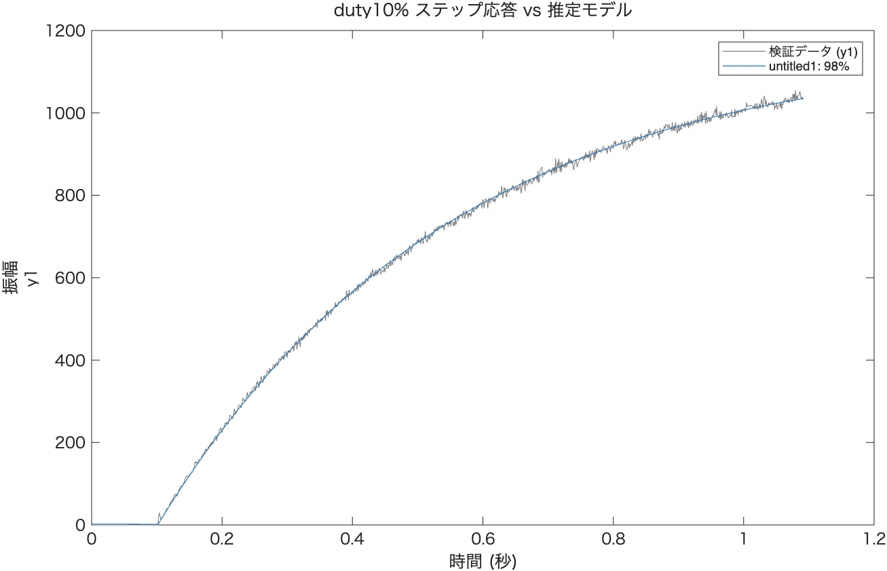
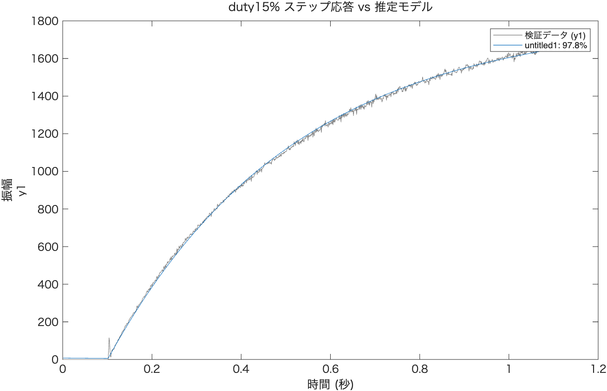
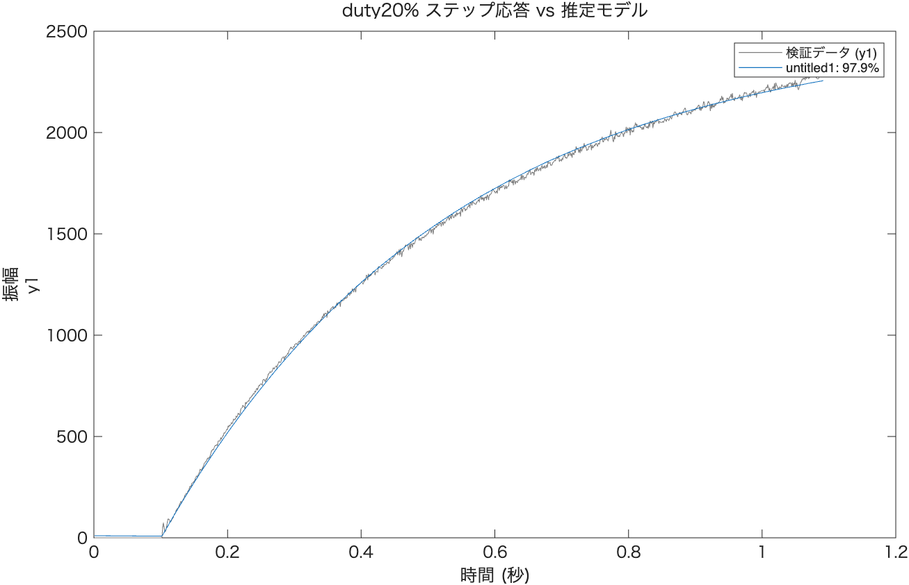
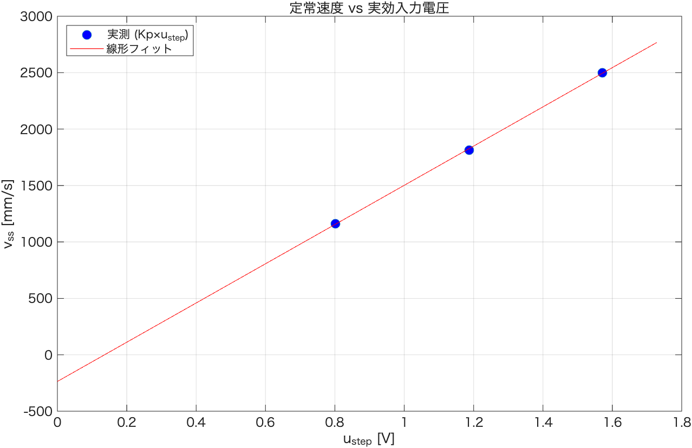
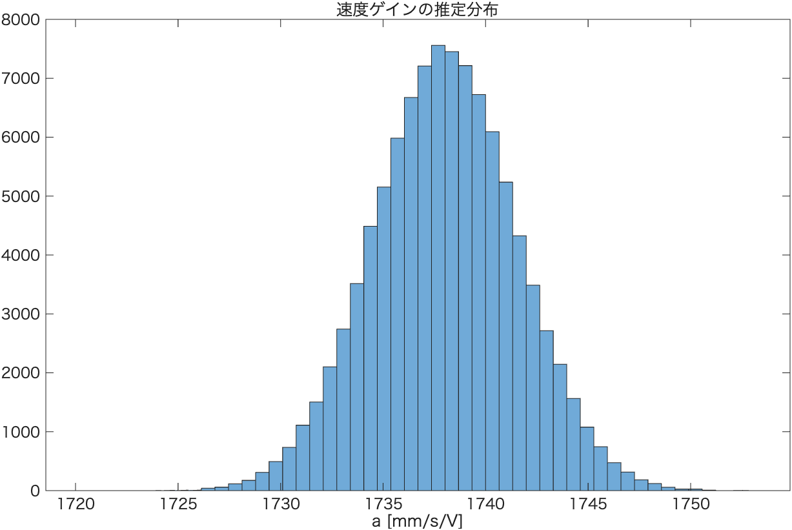
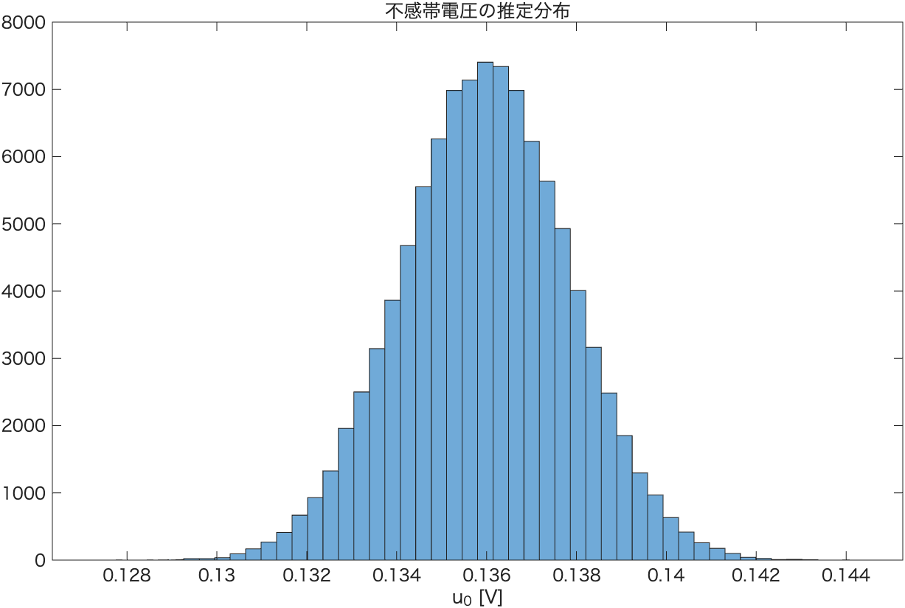

# 並進ステップ応答同定レポート（duty 10% / 15% / 20%）

`tools/log/step_x/step_0_{10,15,20}.csv` の一定duty（同相）ステップ応答ログを用いて，
左右モーター実効入力電圧 $u = duty \times V_{batt}$ から並進速度 $v$（左右エンコーダ速度平均）までの
1次遅れモデル（P1）を同定し，さらに3点の定常値からアフィンモデル $v_{ss} = a(u-u_0)$ を推定した結果。

- 解析コード: [`step_analyze.m`](./step_analyze.m)
- 使用ツール: MATLAB R2026a, System Identification Toolbox (`procest`)
- 生データ: `tools/log/step_x/`（gitignore対象のため本リポジトリには含まれない。列: `Global_time, left_encoder_velocity, right_encoder_velocity, battery, Left_Duty, Right_Duty, gyro_z, accel_x`）
- 生成物: `results/`（本レポート内で参照する図・CSV一式）

**前処理に関する注記**: 各ログの終端付近（約50〜60ms）はブレーキ指令による減速区間であり，
ステップ応答として同定に使用できない（3水準とも実測で確認: 終端直前で速度がピークを打った後，
最後の20msビンで約12〜13%急落する）。`load_step_data`はログ終端から`brake_margin=0.06s`を
切り捨てた区間のみを`iddata`に使用する。

---

## 1. 各duty水準のP1（1次遅れ）モデル同定結果

| duty | $K_p$ [mm/s/V] | 標準誤差 | $T_{p1}$ [s] | 標準誤差 | $u_{step}$ [V] | $v_{ss}=K_p u_{step}$ [mm/s] | フィット率 |
|---|---|---|---|---|---|---|---|
| 10% | 1450.4 | ±1.4 | 0.4485 | ±0.0009 | 0.802 | 1163.2 | 97.95% |
| 15% | 1529.4 | ±1.5 | 0.4165 | ±0.0009 | 1.187 | 1815.0 | 97.69% |
| 20% | 1591.2 | ±1.6 | 0.4260 | ±0.0009 | 1.571 | 2500.2 | 97.80% |

$u_{step}$は各試行でduty立ち上がり後0.3〜1.0秒区間の実効電圧平均。

ブレーキ区間除外前（旧版）はフィット率93%程度・$K_p$標準誤差±3〜4だったのに対し，除外後は
フィット率98%前後・標準誤差±1.5程度まで改善した。ブレーキ区間の混入がモデルの残差を系統的に
悪化させていたことを示している。

生データ・フィット結果:

- 
- 
- 

（編集可能な `.fig` 版も `results/step_duty{10,15,20}_fit.fig` に保存）

$K_p$がduty水準間で約10%異なっており（1450.4→1591.2），不感帯（静止摩擦）の存在が疑われる。
$T_{p1}$はduty間でほぼ一定（0.42〜0.45s）であり，1次遅れ構造がduty水準に依らず妥当であることを支持する。

---

## 2. 不感帯の定量評価

3点 $(u_{step,i},\ v_{ss,i})$ に対しアフィンモデル $v_{ss}=a(u-u_0)$ を最小二乗直線フィット（`polyfit`）：

**モンテカルロ法による不確かさの伝播**（各duty水準の$K_p$の共分散を用い，3点の直線フィットを$N=10^5$回繰り返し）：

| 量 | 値 |
|---|---|
| 真の速度ゲイン $a$ | 1738.0 ± 3.5 mm/s/V |
| 不感帯電圧 $u_0$ | 0.1360 ± 0.0019 V （95%区間: [0.1323, 0.1396]） |

分布:

- 
- 

$u_0$の95%区間が明確に0を含まないため，**不感帯は統計的に有意**。
`data_analysis/translational_system_identification_report.md`（duty 10%/20%の2点，$u_0\approx0.141V$）と近い値であり，同一機体の不感帯特性として整合的。

---

## 3. 数値データ（再利用用）

- [`results/step_identification_summary.csv`](./results/step_identification_summary.csv) — 各duty水準の$K_p$, $T_{p1}$, フィット率, $u_{step}$, $v_{ss}$
- [`results/step_identification_final.csv`](./results/step_identification_final.csv) — $a$, $u_0$（点推定・モンテカルロ平均・標準偏差・95%区間）

---

## 4. まとめ

- ログ終端のブレーキ区間（約60ms）を同定対象から除外することで，P1フィット率が93%台→98%前後，パラメータ標準誤差が約1/2〜1/3に改善した
- duty 10%/15%/20%のステップ応答はいずれもP1（1次遅れ）モデルで97%以上のフィット率を達成
- 定常速度は実効入力電圧に対しほぼ線形（$a\approx1738$ mm/s/V）
- 不感帯電圧 $u_0\approx0.136V$ は統計的に有意だが，運用duty範囲を不感帯から十分離すことで運用上は無視可能と判断（`data_analysis`の既存結論と同方針）
