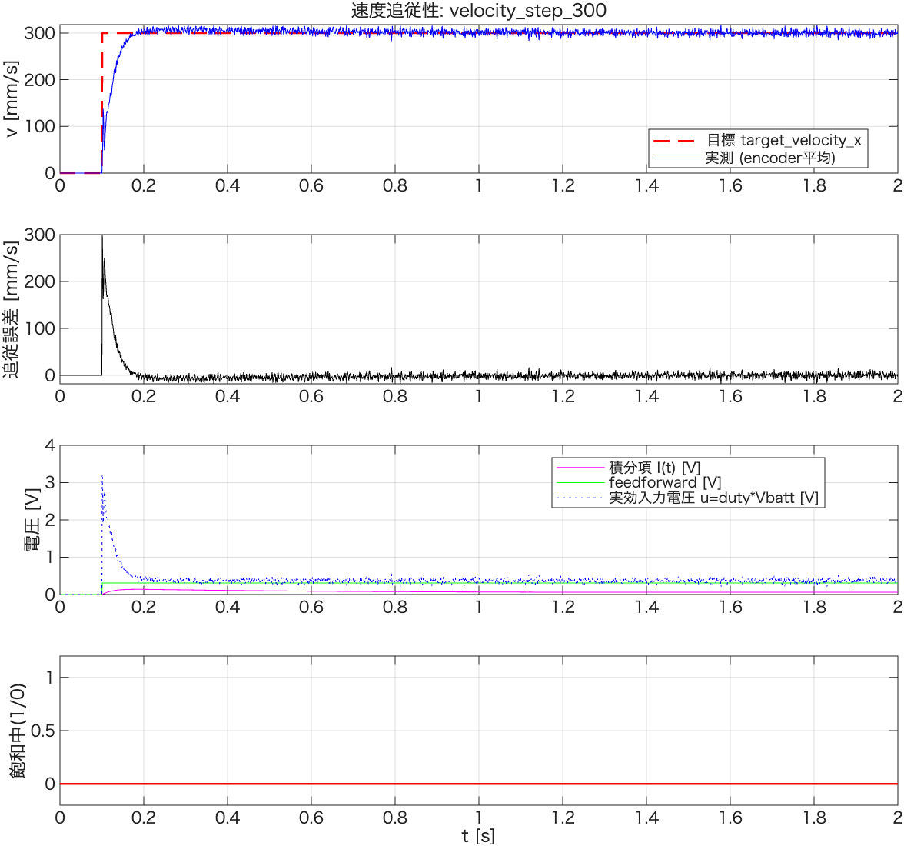
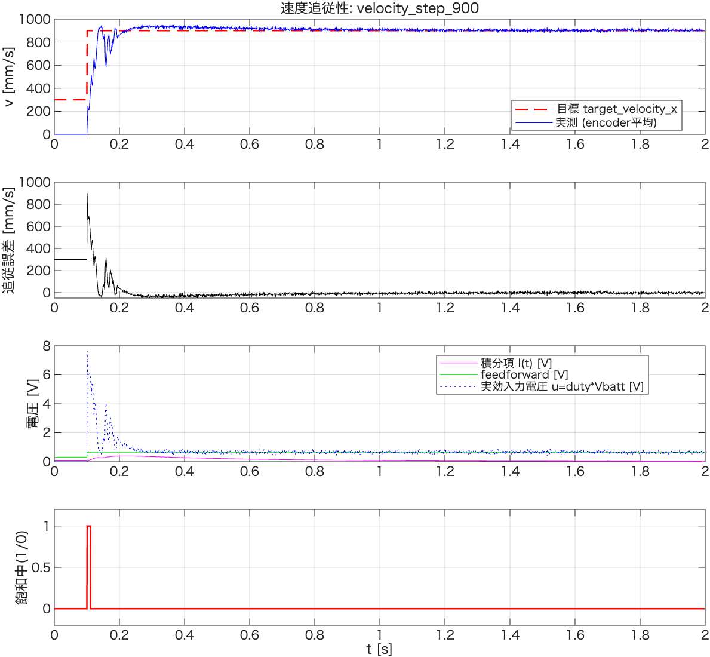

# λ=0.03 実機検証レポート

`velocity_lambda_sweep_report.md`の推奨（λ=0.03〜0.04から試す）を受け，実機で
`config::pid_velocity_x::LAMBDA`を0.10→**0.03**に変更し，v step +300, +900を再取得した結果。

- 解析コード: [`velocity_step_analyze.m`](./velocity_step_analyze.m),
  [`velocity_step900_lambda03_check.m`](./velocity_step900_lambda03_check.m)
- 生データ: `tools/log/velocity_step_x/velocity_step_{300,900}.csv`（λ=0.03取得分）

---

## 1. v step +300（λ=0.03）

| 量 | λ=0.10（前回） | λ=0.03（今回） |
|---|---|---|
| 整定時間目安 | 約0.3〜0.4s | **約0.2s** |
| 定常誤差 平均/標準偏差 | -0.3 / 4.7 mm/s | 0.1 / 5.4 mm/s |
| \|I(t)\|max | 0.122 V | 0.138 V |
| 飽和時間割合 | 0.0% | 0.0% |

オーバーシュート・振動なく，シミュレーション（`velocity_lambda_sweep_report.md`）通り
**明確に高速化され，かつ健全**な追従が確認できた。

## 2. v step +900（λ=0.03）

定常状態は良好（誤差-2.2mm/s，飽和0.5%，windupなし）だが，**立ち上がり直後（t=0.1〜0.25s付近）
に速度が900mm/s付近で2〜3回振動してから収束する**挙動が見られた。飽和(`pid_saturated`)は
ステップ直後の数tick（0.5%）だけ発生している。

## 3. シミュレーションによる原因切り分け

同一条件（λ=0.03, target=900, 同定済みP1プラント + 実装と同一のback-calculation構造）で
シミュレーションを再現したところ，`back_calc_tt`を$T_{p1}$〜$T_{p1}/10$まで変えても
**振動は一切再現されなかった**（[結果図](./results/velocity_step900_lambda03_tt_check.png)）。
線形モデル上ではなめらかに単調収束する。

| $T_t$ | 最大速度 | 飽和割合 |
|---|---|---|
| $T_{p1}$（現行） | 946 mm/s | 1.5% |
| $T_{p1}/2$ | 945 mm/s | 1.5% |
| $T_{p1}/5$ | 941 mm/s | 1.5% |
| $T_{p1}/10$ | 934 mm/s | 1.3% |

$T_t$を変えても振動が出ない＝**back-calculationのパラメータ選択が原因ではない**ことを示している。

## 4. 考察

実機の振動はP1モデル+実装した制御則では説明できないため，**制御ループの設計問題ではなく，
モデル化されていない物理的要因**（0→900mm/sへの急加速時の車輪スリップ／トラクション喪失，
またはその際のエンコーダ計測の乱れ）による可能性が高い。v=300では同じλ=0.03でも
振動が出ていないことも，大振幅ステップ特有の高トルク要求時にのみ問題が顕在化することと整合する。

## 5. 結論・推奨

- **λ=0.03は制御則として問題なし**。v=300では明確に高速化・健全な追従を確認
- v=900相当の大きな速度ステップでは，立ち上がり時のスリップと思われる一時的な振動が
  実機でのみ観測される（シミュレーションでは非再現）。ゲイン再調整では解決しない可能性が高い
- 対策の方向性（フォローアップ課題）:
  1. `translational_gain_tuning.md` §2.4が推奨する**台形加減速プロファイル**の導入
     （目標速度をstepでなくランプで与え，急加速自体を避ける）
  2. 大振幅ステップ時のみ加速度（duty変化率）に上限を設ける
  3. 現状でも定常収束は良好なため，緊急の対応は不要。ゲインスケジューリングや
     台形加減速の実装時に合わせて対応する
