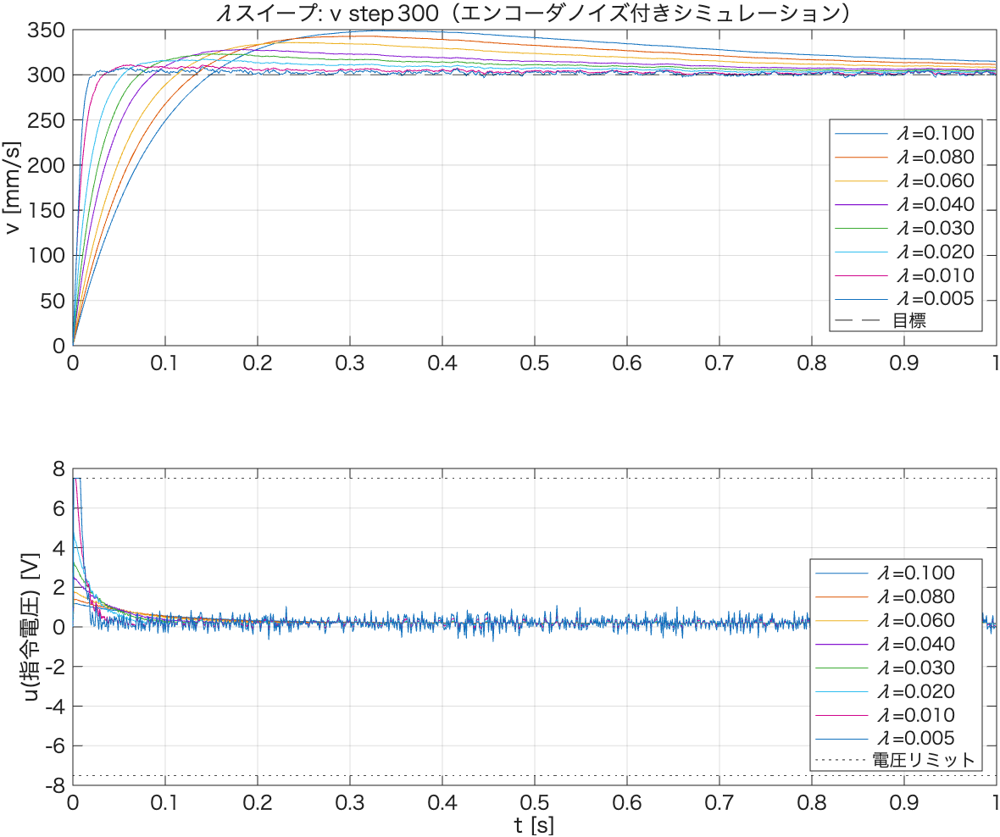

# λスイープによる高速化時の安定性検証（シミュレーション）

`config::pid_velocity_x::LAMBDA`を小さくして追従を高速化した場合に発散・不安定化しないかを，
実機投入前にMATLABシミュレーションで確認した記録。

- 解析コード: [`velocity_lambda_sweep.m`](./velocity_lambda_sweep.m)
- 対象: v step 300相当，プラントは`prbs_identification_report.md`のP1モデル
  （$K_p=1518.9$, $T_{p1}=0.4451$）
- ファームウェアの離散実装（PI + back-calculationアンチワインドアップ + 電圧飽和 + feedforward）
  を1kHzでそのまま再現。実測`velocity_step_300.csv`定常区間の速度標準偏差（4.7mm/s）を
  エンコーダ観測ノイズとして注入

**用語の確認**: IMC整定 $K_p=T_{p1}/(K_p^{plant}\lambda)$ より，**λは小さくするほど追従が速くなる**
（λ＝閉ループ時定数）。ゲインはλに反比例して増大する。

---

## 結果

| λ | $K_{p,fb}$ | $K_{i,fb}$ | 定常速度標準偏差 [mm/s] | 定常指令電圧標準偏差 [V] | 飽和割合 [%] |
|---|---|---|---|---|---|
| 0.100（現行） | 0.00293 | 0.00658 | 3.64 | 0.014 | 0.0 |
| 0.080 | 0.00366 | 0.00823 | 2.70 | 0.017 | 0.0 |
| 0.060 | 0.00488 | 0.01097 | 1.78 | 0.023 | 0.0 |
| 0.040 | 0.00733 | 0.01646 | 0.94 | 0.034 | 0.0 |
| 0.030 | 0.00977 | 0.02195 | 0.61 | 0.046 | 0.0 |
| 0.020 | 0.01465 | 0.03292 | 0.56 | 0.069 | 0.0 |
| 0.010 | 0.02930 | 0.06584 | 0.99 | 0.139 | 0.3 |
| 0.005 | 0.05861 | 0.13167 | 1.54 | 0.285 | 0.8 |

---

## 考察

- **今回シミュレーションした範囲（λ=0.10〜0.005）では文字通りの発散（速度・電圧の無限大発散）は
  生じなかった**。IMC整定のPI+安定な1次プラントは，連続時間では理論上どのλでも安定であり，
  1kHzサンプリングもこの範囲では十分高速なため，その性質が概ね保たれている。
- λ=0.10→0.02にかけては，λを小さくするほど定常速度の標準偏差（ノイズによる乱れ）が
  **むしろ小さくなる**（3.64→0.56mm/s）。フィードバックが強くなり外乱除去性能が上がるため。
- λ<0.02では逆に速度標準偏差が増加に転じ（0.56→1.54mm/s），**飽和割合も0%から0.8%へ増加**。
  図の速度応答でもλ=0.01, 0.005であきらかなオーバーシュート（約340〜350mm/s、目標300に対し
  13〜17%）が確認できる。指令電圧も立ち上がり直後に電圧リミットへ張り付く場面が出てくる。
- したがって「発散はしないが，λ≲0.01付近からオーバーシュートと飽和頻度が目に見えて増え，
  ゲインがノイズに対して過敏になり始める」というのがこのモデル上での結論。

## 制限事項（重要）

このシミュレーションは**同定済み線形P1モデル＋実測ノイズ水準の注入**によるものであり，
以下は反映されていない：
- モータ電気系・PWM・ギアバックラッシュ等，P1モデルに含まれない高速ダイナミクス
- `prbs_identification_report.md`で確認した残差の未説明構造（線形P1モデルの枠外の要因）
- 左右輪の非対称性，機体のヨー方向への影響（並進速度制御は左右同一指令のため今回は考慮外）

実際の安定限界はこのシミュレーションが示すより**厳しい（＝より大きいλで不安定化しうる）**
可能性がある。そのため実機検証は，シミュレーションで良好だった範囲の**保守的な値から**
段階的に下げていくことを推奨する。

## 推奨

- まず **λ=0.04〜0.03** 程度を実機の`Motor velocity X`メニュー（v step +300等）で試す
  （シミュレーション上は飽和なし・オーバーシュートなしで，現行λ=0.10より明確に速い）
- 問題なければ λ=0.02 まで下げて再確認。振動的な挙動や異音が出ないか，
  `pid_saturated`列が有意に立たないかを`velocity_step_analyze.m`で確認
- λ<0.02は本シミュレーションでもオーバーシュート・飽和の兆候が出ているため，
  実機では慎重に（低速域や短時間トライアルから）様子を見ながら下げること
